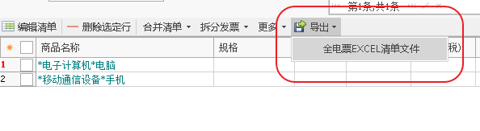
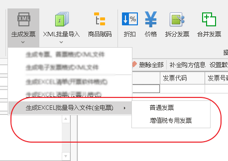

# 全电票导入

## 单张开具-清单导入

1. 在清单表格工具栏上点击【导出】【全电票EXCEL清单文件】，保存文件.

2. 在全电发票开具页面导入该清单文件.

## 批量开具

1. 选中所有要开具的发票。
2. 在软件工具拦上【生成发票】【生成EXCEL批量导入文件(全电票)】，如果批量开具的是普通发票，就点击【普通发票】，如果要开具的是专用发票，就点击【增值税专用发票】，保存文件。

3. 在全电发票批量开具界面导入上一步生成的文件。 如果文件内容有错误，导入后会有提示，根据提示修改表单。重复前面步骤，直到导入提示没有问题。